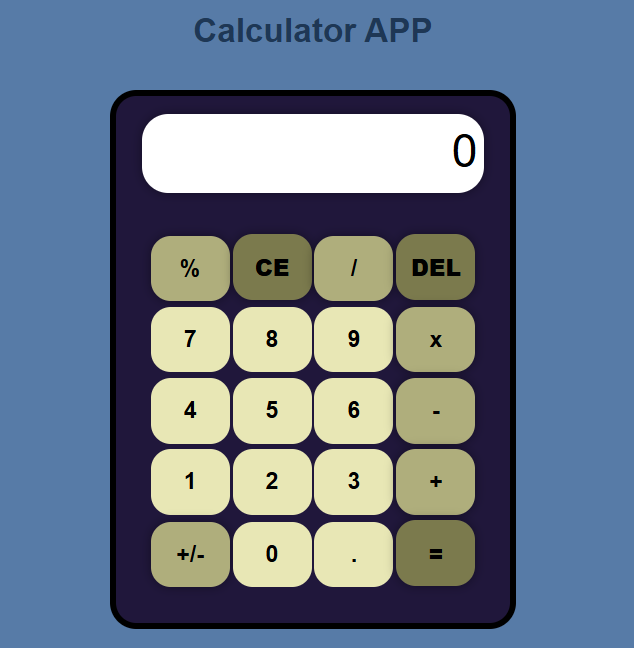

# 🧮 Interactive Glassmorphism Web Calculator

A high-performance, modern web calculator built with dynamic **Glassmorphism UI**, **Floating Mathematical Background Animations**, **Typewriter Title Header**, complete **Keyboard Navigation**, and a clean, refactored ES6 JavaScript engine.

---

## 🤵 Repository Host Details

- **Author Name:** amir
- **GitHub Profile:** [amirsohail100](https://github.com/amirsohail100)
- **Project Status:** Production Ready 🟢

---

## 📸 Live Preview of the Interface



---

## 🚀 Key Features & Technical Highlights

- **High-Contrast Glass Panel:** Vibrant neon borders, high-visibility glows, and multi-layered drop shadows optimized for both Dark and Light modes.
- **High-Visibility Floating Background:** Real-time CSS keyframe animations drifting mathematical symbols (`+`, `−`, `×`, `÷`, `%`, `√`, `π`, `=`) across the screen with boosted opacity.
- **Dynamic Typewriter Header:** Animated typing, holding, and backspacing cycle on the main title (`Calculator App`).
- **Refactored JS Engine:** Standardized descriptive variable/function names, eliminated nested event listener memory leaks, and added robust precision handling (`NaN` & overflow protection).
- **Full Keyboard Integration:** Complete desktop support for numeric inputs (`0-9`), operators (`+`, `-`, `*`, `/`), evaluation (`Enter`), backspace deletion (`Backspace`), and clearing (`Escape`).

---

## 📂 Modular Architecture

| File Name           | Responsibility                                                                           |
| :------------------ | :--------------------------------------------------------------------------------------- |
| 🌐 **`index.html`** | Semantic UI structure, typewriter header controller, and floating background wrapper.    |
| 🎨 **`style.css`**  | High-contrast glassmorphism styles, glowing theme palettes, and CSS keyframe animations. |
| 🧠 **`script.js`**  | Cleaned JS calculation engine, edge-case validator, and keyboard input handlers.         |

---

## ⌨️ Keyboard Shortcuts Support

| Key                | Action                   |
| :----------------- | :----------------------- |
| `0` - `9` / `.`    | Input Numbers & Decimals |
| `+`, `-`, `*`, `/` | Arithmetic Operators     |
| `Enter` / `=`      | Calculate Result         |
| `Backspace`        | Delete Last Character    |
| `Escape`           | Clear All (`CE`)         |

---

## 🛠️ Tech Stack

- **HTML5:** Semantic Structure & Dynamic Backdrop Elements
- **CSS3:** Custom Theme Variables, Keyframe Animations, Glassmorphism Backdrop Blur
- **JavaScript (ES6):** Modular Event Handling, Expression Evaluation, Keyboard Mapping Engine

---

## 🚀 How to Run Locally

```bash
git clone [https://github.com/amirsohail100/MY_HTML_CSS_JS_Calculator.git](https://github.com/amirsohail100/MY_HTML_CSS_JS_Calculator.git)
cd MY_HTML_CSS_JS_Calculator
```
